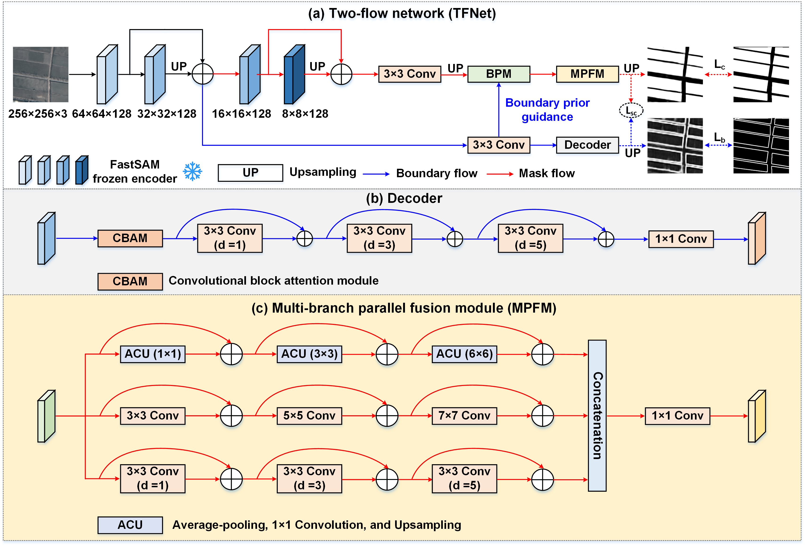

# TFNet

Official Pytorch Code base for "Integrating Segment Anything Model derived boundary prior and high-level semantics for cropland extraction from high-resolution remote sensing images"

[Project](https://github.com/long123524/TFNet)

## Introduction

We propose a two-flow network based on multitask VFM, named TFNet, to extract croplands with well-delineated boundaries from high-resolution remote sensing images. TFNet consists of a mask flow and a boundary flow. It first uses a VFM as visual encoder to obtain universal semantic features regarding croplands, and then aggregates them into the two flows.  

<p align="center">
  
</p>

## Using the code:

The code is stable while using Python 3.9.0, CUDA >=11.0

- Clone this repository:
```bash
git clone https://github.com/long123524/TFNet
cd TFNet
```

## Installation

Install [FastSAM](https://github.com/CASIA-IVA-Lab/FastSAM) following the instructions.
Modify the Ultralytics source files following the instructions at: 'SAM/models/FastSAM/README.md'.

## Preprocessing
Using the code preprocess.py to obtain boundary maps.

## Data Format

Make sure to put the files as the following structure:

```
inputs
└── <train>
    ├── image
    |   ├── 001.tif
    │   ├── 002.tif
    │   ├── 003.tif
    │   ├── ...
    |
    └── mask
    |   ├── 001.tif
    |   ├── 002.tif
    |   ├── 003.tif
    |   ├── ...
    └── contour
    |   ├── 001.tif
    |   ├── 002.tif
    |   ├── 003.tif
    |   ├── ...
    └── ...
```

For testing and validation datasets, the same structure as the above.

## Training and testing

Our code will release after our paper is accepted.

## A pretrained weight
A pretrained weight of FastSAM is provided: https://drive.google.com/file/d/1fr9rrn59TEHYr4-QikTPGxGWs-8PEgVi/view?usp=sharing

## A GF-2 dataset
Shandong GF-2 image:https://drive.google.com/file/d/1JZtRSxX5PaT3JCzvCLq2Jrt0CBXqZj7c/view?usp=drive_link A corresponding cropland label will be available. 

### Citation:
If you find this work useful or interesting, please consider citing the following references.
```
[1] Long J, Zhao H, Li M, et.al. Integrating Segment Anything Model derived boundary prior and high-level semantics for cropland extraction from high-resolution remote sensing images. IEEE GEOSCIENCE AND REMOTE SENSING LETTERS.
[2] Long J, Li M, Wang X, et.al. Delineation of agricultural fields using multi-task BsiNet from high-resolution satellite images. International Journal of Applied Earth Observation and Geoinformation, 2022, 112:102871.
[3] Li M, Long J, Stein A, et.al. sing a semantic edge-aware multi-task neural network to delineate agricultural parcels from remote sensing images. ISPRS Journal of Photogrammetry and Remote Sensing, 2023, 200:24-40.

```
